# LearnOps — GHL + n8n + AI Course Intake Automation

LearnOps is a demo automation system for an online course or coaching business. It captures course inquiries through GoHighLevel, sends lead data to n8n via webhook, classifies the lead using AI, and logs the full CRM record into Google Sheets.

---

## Project Goal

The goal of LearnOps is to automate the intake and qualification process for course inquiries.

The system helps an education/coaching business:

* Capture new course inquiries
* Add CRM tags in GoHighLevel
* Create pipeline opportunities
* Send personalized confirmation emails
* Notify the admin team
* Send lead data to n8n via webhook
* Clean and normalize lead data
* Classify leads using AI
* Log results into Google Sheets

---

## Tools Used

* GoHighLevel
* n8n
* OpenAI
* Google Sheets
* Google Workspace
* ngrok
* Webhooks
* JSON parsing

---

## Phase 1 Workflow

### GoHighLevel

A lead submits the LearnOps Course Inquiry Form.

The GHL workflow then:

1. Adds intake tags
2. Creates or updates an opportunity in the course enrollment pipeline
3. Sends lead data to n8n through a webhook
4. Sends a personalized confirmation email
5. Sends an internal admin notification

### n8n

n8n receives the webhook and:

1. Cleans the incoming GHL payload
2. Maps fields into a standard CRM format
3. Sends the lead details to OpenAI
4. Receives an AI lead classification
5. Parses the AI JSON response
6. Logs the complete record into Google Sheets

---

## AI Classification Output

The AI returns:

* Lead score
* Lead temperature
* Priority
* Lead category
* Qualification reason
* Recommended action
* Suggested pipeline stage
* Suggested tags
* Personalized email angle
* Admin summary

---

## Example Use Case

A lead submits a course inquiry for a GoHighLevel Setup Course.

The automation classifies the lead as Warm, assigns medium priority, recommends a nurture follow-up, and logs the lead details into the CRM spreadsheet.

---

## Screenshots

### GHL Course Inquiry Form

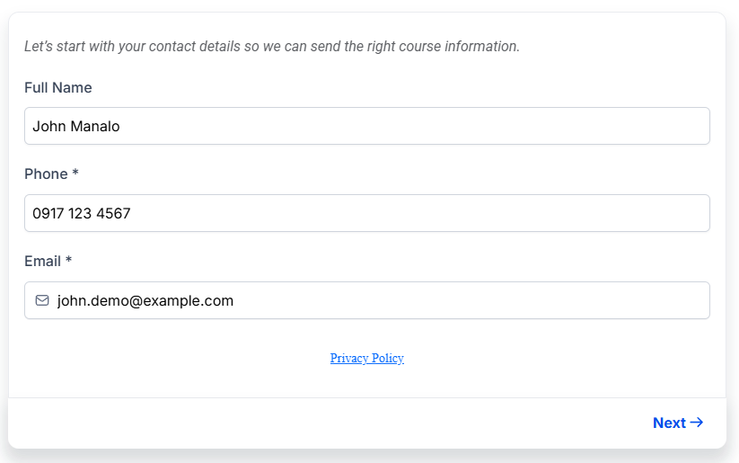

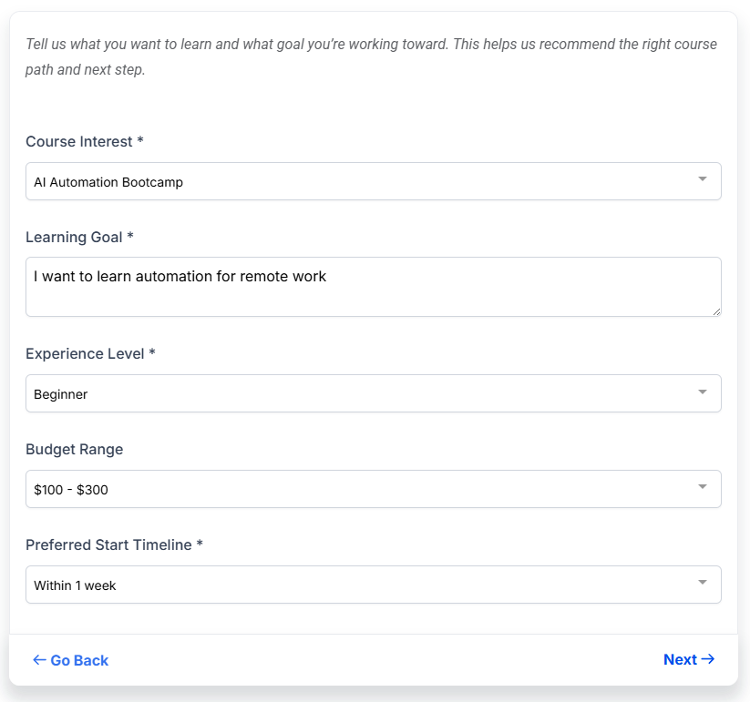

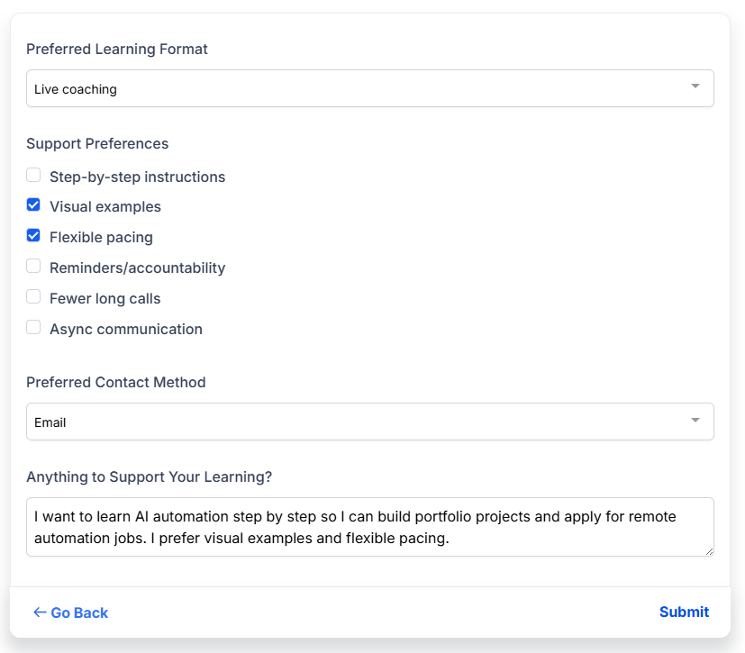

### GHL Workflow

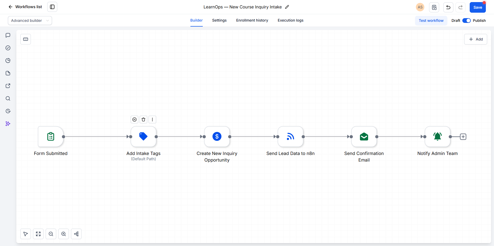

### GHL Pipeline and Contact

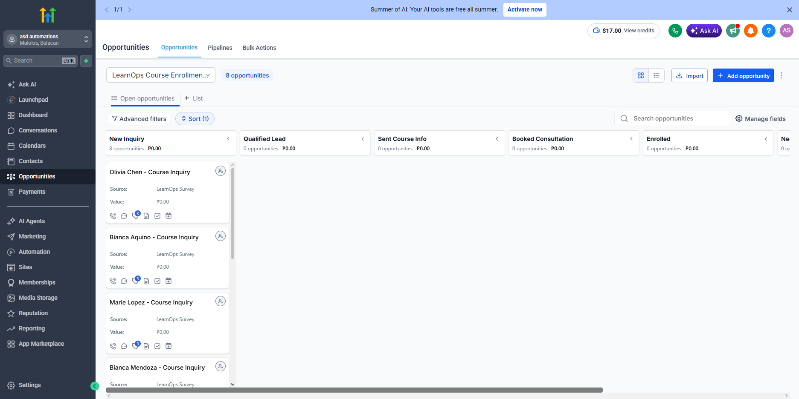

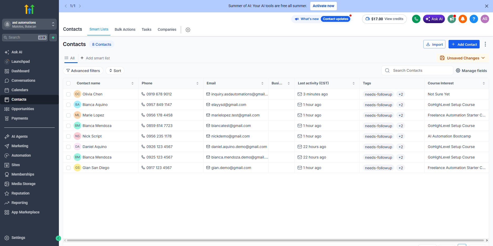

### Email and Notification

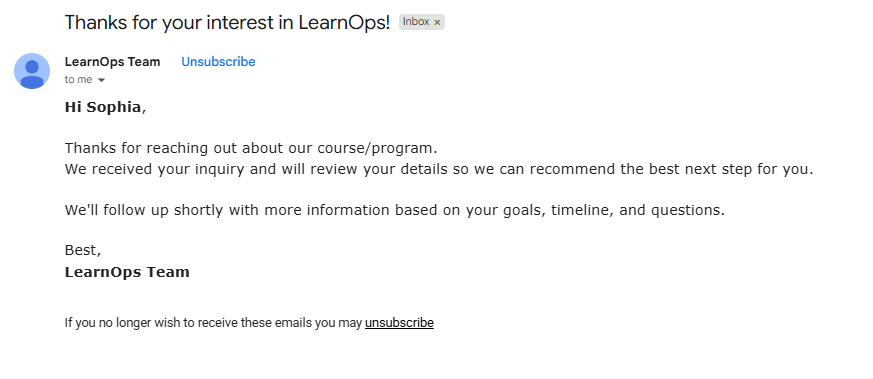

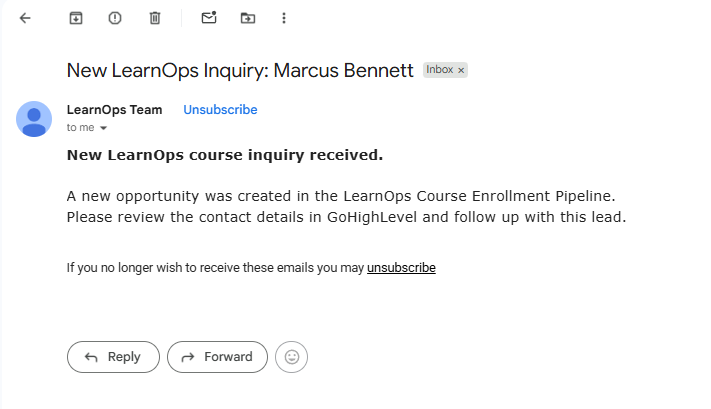

### n8n Workflow

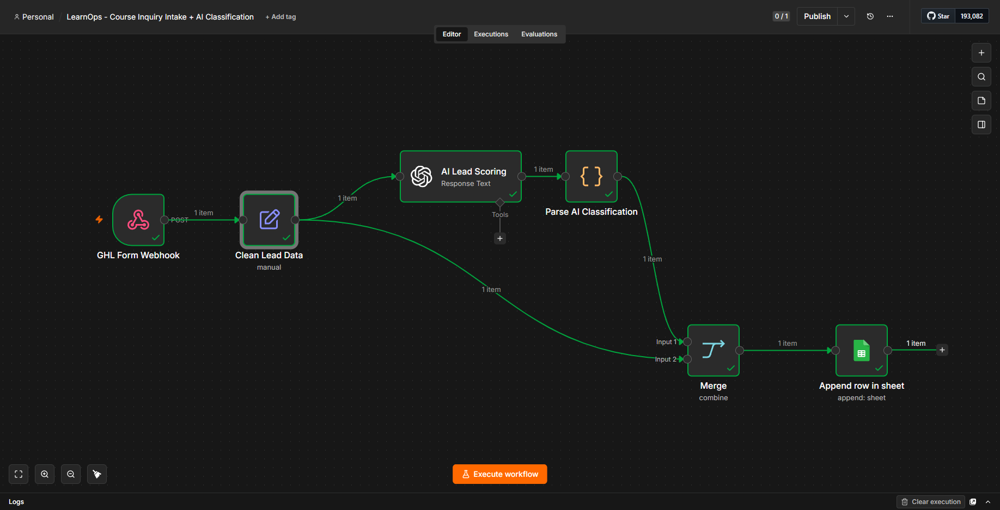

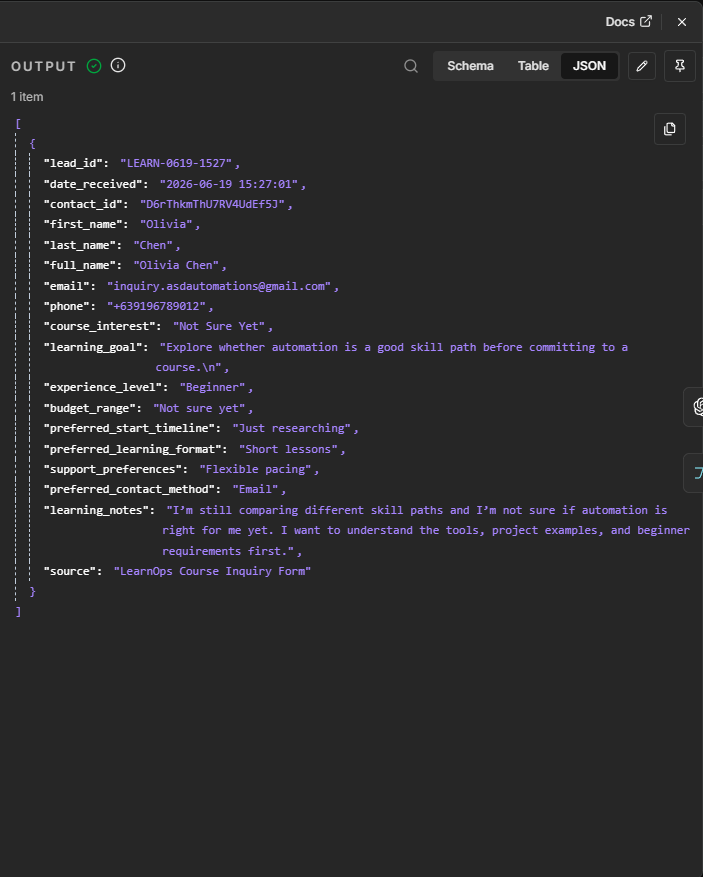

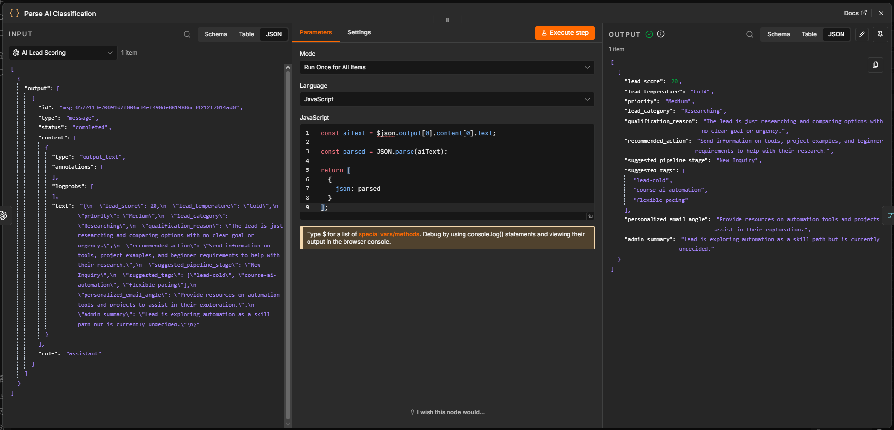

### Google Sheets CRM Log

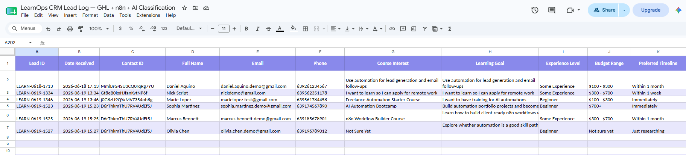

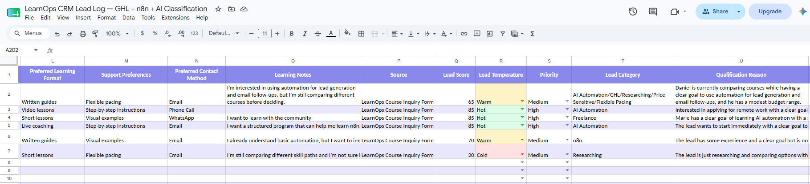

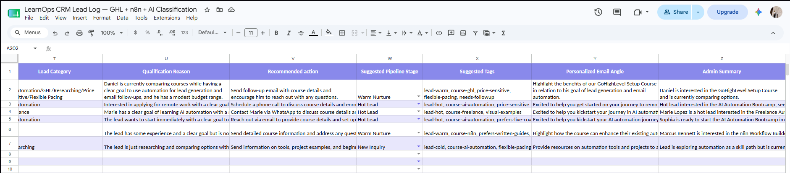

---

## Phase 1 Status

Completed.

Phase 1 includes:

* GHL form intake
* GHL workflow automation
* CRM tagging
* Opportunity creation
* Confirmation email
* Internal notification
* Webhook to n8n
* Lead data cleanup
* AI lead classification
* JSON parsing
* Google Sheets logging

---

## Planned Phase 2

Phase 2 will expand the workflow by using the AI classification result to update GoHighLevel automatically.

Planned features:

* Add AI-based tags to GHL contacts
* Move opportunities to Hot Lead, Warm Nurture, Discount Inquiry, Technical Concern, or Needs Qualification
* Send AI-personalized follow-up emails
* Add activity log records
* Add error handling and monitoring
